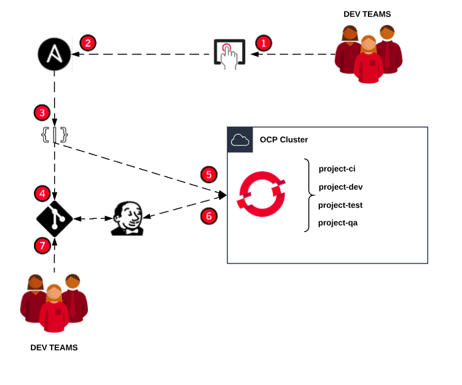

## Repository Information

This repository contains the source code used during Red Hat Summit 2019 Discovery Zone session for the demo aorund "How Volkswagen used microservices and automation to develop self-service solutions" presentation.

[Presentation Slides](https://www.slideshare.net/makimak1/how-volkswagen-used-microservices-and-automation-to-develop-self-service-solutions)

## Configuration and demo case

Ansible Tower will be configured with 4 Projects, corresponding to the each Ansible role under [projects](projects/) directory

Ansible Tower will be configured with 4 Job Templates using the Playbook from each previous configured Project

Ansible Tower will be configured with a Workflow Template using the previuos 4 Job Templates, this way the whole workflow will be executed on the user onboard.

The system will allow the user to select from 3 different approaches, for the simplicity of the demo, only (Container Manifest)[projects/repo-bootstrap/role/bootstrap/templates/manifest_repo] approach example has the complete required code.

## Demo video

[Container Manifest e2e Demo](media/demo.webm)

## High Level Architecture

