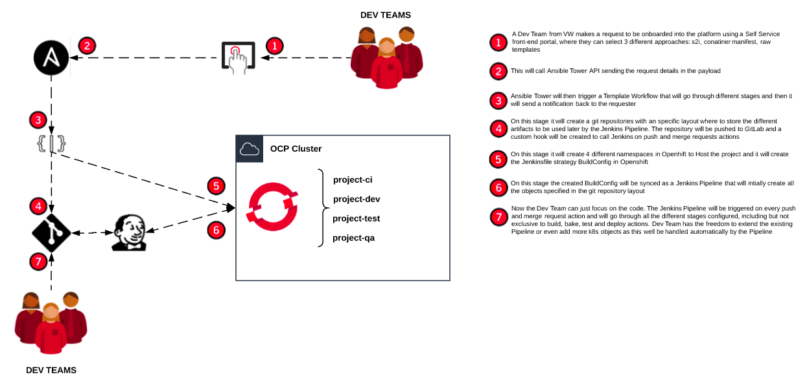

## Repository Information

This repository contains the source code used during Red Hat Summit 2019 Discovery Zone session for the demo aorund "How Volkswagen used microservices and automation to develop self-service solutions" presentation.

[Presentation Slides](https://www.slideshare.net/makimak1/how-volkswagen-used-microservices-and-automation-to-develop-self-service-solutions)

## Demo video

[Container Manifest e2e Demo](media/demo.webm)

## High Level Architecture

